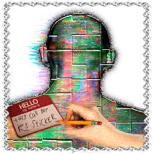

<p align="center">
  
</p>

<h1 align="center">resticker</h1>

<p align="center">Stick anything to your monitor.</p>

resticker puts images, GIFs, videos and pieces of other people's windows on top
of your desktop and then gets out of the way. Clicks pass straight through, so
you can keep working with a sticker sitting over your text editor. When you
actually want to move something, one hotkey turns the whole screen into an
editor, and another turns it back.

It also does a few things to windows themselves: pin one on top, slice one in
half, cut a rectangle out of one, or collect several into a numbered group that
comes back with `Ctrl+Alt+3`.


---

## Status

**Shipped:** stickers (images, GIF/APNG/WebP animation, video with sound and a
seek bar, transparent video), the edit mode with handles, rotation, snapping,
marquee select and undo/redo, visibility layers, window pinning, window groups,
window crop, window mitosis, presets, multi-monitor with hot-plug, tray,
autostart, silent start, ru/en interface, and an NSIS installer.

**Measured** on the dev machine (two monitors, 2560×1440 and 1920×1080,
GTX 1070 Ti, release build):

| | Measured |
|---|---|
| Idle RAM, everything closed | **62 MB**, one process |
| Idle CPU | **0 %** |
| Three animations and a video on screen | **96 MB**, ~3 % of one core |
| Settings window, cold open | **~300 ms** |
| WebView2 processes while its windows are closed | **0** |

The settings window and the tray menu are built only when you open them and
destroyed when you close them, so most of the time there is no browser engine
in memory at all. FFmpeg is delay-loaded too: no video, no 100 MB of decoder
mapped into the process.

**Not verified:** mixed DPI (both monitors here are 100 %), and every video
format except MP4/H.264. The list of extensions comes from the code, not from
a test run of each one.

---

## Install

Grab `resticker_x.y.z_x64-setup.exe` from the
[latest release](../../releases/latest) and run it. It installs per user, no
admin rights needed.

> SmartScreen will warn on first run. The build isn't code-signed, certificates
> cost money this project doesn't have. *More info → Run anyway*, or build it
> yourself below.

Windows 11 x64 only. Windows 10 isn't supported.

---

## Hotkeys

| | |
|---|---|
| `Ctrl+Alt+S` | edit mode, in and out |
| `Ctrl+Alt+H` | show / hide every sticker |
| `Ctrl+Alt+M` | mute / unmute |
| `Ctrl+Alt+T` | pin the window under the cursor on top |
| `Ctrl+Alt+U` | unpin everything |
| `Ctrl+Alt+G` | window group menu |
| `Ctrl+Alt+1` … `9` | bring back a group |
| `Ctrl+Alt+Shift+G` | delete the open group |
| `Ctrl+Alt+Shift+T` | pin the open group on top |
| `Ctrl+Alt+F` | slice a window in half |
| `Ctrl+Alt+C` | cut a piece out of a window |

All of them are rebindable in Settings → Controls and take effect immediately.
Only the edit-mode one is mandatory; the rest can be cleared. If something else
already owns a combination, the app tells you on screen instead of silently
doing nothing.

---

## Features

**Stickers**
- Images: PNG, JPG, WebP, BMP, GIF
- Animation: GIF, APNG, animated WebP, recognised by the file's magic bytes
  rather than its extension
- Video: MP4, MKV, WebM, MOV, AVI, WMV, FLV, MPG, TS, M2TS, 3GP, OGV and the
  rest of what FFmpeg reads, with sound, looping and a seek bar
- Transparent video: VP9 with alpha, ProRes 4444
- Hardware decode through D3D11VA, the frame never travels through the CPU
- Per-sticker opacity, rotation, flip and z-order

**Edit mode**
- Eight handles, rotation by the corner, `Shift` keeps the ratio, `Alt` resizes
  from the center, `Shift` while rotating snaps to 15°
- Marquee and `Shift`+click for multiple stickers, magnets to monitor edges and
  centers
- `Ctrl+Z` / `Ctrl+Shift+Z`
- A toolbar under the selection: opacity, visibility layers, hide, order,
  duplicate, delete
- A hidden sticker shows up as the black-and-pink missing-texture checkerboard,
  because that's what it deserves

**Visibility layers**

This is the part I like most. Every sticker decides what it hides under:
always on top, desktop only, under any window that covers it, under a chosen
list of windows, or over everything except a chosen list. The window list is
live: open a new window and it appears there.

**Windows**
- Pin the window under the cursor on top, optionally with an outline
- Snap gap: when a window snaps to an edge it shrinks by a few percent so the
  sticker underneath stays visible
- Groups: tick a few windows, give them a number, and the whole layout comes
  back with `Ctrl+Alt+<number>`. Groups are tied to the boot session, since
  after a reboot those windows don't exist anymore
- Crop: drag a rectangle out of any window and keep that piece floating on top.
  It's a live mirror, the content updates with the source. It also **can't be
  clicked** — it's mirrored pixels, not a window, and Windows has no way to
  deliver a click into it. The strip on top is how you move and pin it
- Mitosis: cut a window in half and get a second instance of the same app next
  to it. The axis picks itself from where the cursor is. Made for two Explorer
  windows side by side, works for anything that can open a second window

**Presets**

Save the whole arrangement under a name and bring it back in one click. If a
file went missing since you saved it, the app says which ones didn't make it.

**Multi-monitor**

Stickers live in their own monitor's coordinates and can be dragged across.
Plugging, unplugging and resolution changes are handled live: unplug a monitor
and its stickers move to the primary one, plug it back and they return.


---

## A few notes from the build side

- Stickers aren't web views. They're drawn with Direct3D 11 and
  DirectComposition into one native window per monitor, so 40 stickers still
  cost one window, not 40. Tauri only runs the settings window and the tray
  menu.
- Those two windows are created on demand and destroyed on close. That's where
  most of the memory went before: two hidden WebView2 windows were holding
  around 350 MB of browser processes doing nothing.
- A hidden sticker isn't loaded at all. In the editor it shows its first frame
  under the checkerboard, and a minute after you hide it the atlas is dropped.
- Animations are downscaled to the size they're actually drawn at. A 718×1280
  GIF shown as a 289×514 sticker was keeping a 315 MB atlas of full-resolution
  frames.
- Frames of an animation live in one texture atlas, so playing it only swaps UV
  coordinates instead of uploading a new frame every tick. Streaming
  frame-by-frame was measured and it costs several times more CPU.
- Window crop pieces are real windows, not sprites: one for the content, one
  for the strip, and the content one never takes focus so your cursor stays
  where you were typing.
- The window tracker only does a full sweep of every window when it sees one it
  doesn't know. Alt-tabbing just re-reads the z-order.
- Config is `%APPDATA%\resticker\config.json`, logs are in
  `%LOCALAPPDATA%\resticker\logs`. `RUST_LOG=resticker=debug` makes them
  talkative.

---

## What it can't do

Windows limitations, not bugs:

- Exclusive fullscreen games own the output, no overlay shows up over them.
  Borderless is fine.
- A window running as administrator can't be pinned, sliced or cropped unless
  resticker runs elevated too.
- DRM-protected video (Netflix in a browser, that sort of thing) does whatever
  it wants underneath the overlay.
- Transparent video decodes on the CPU. GPUs don't do alpha.
- A window minimised to the tray is invisible to the enumeration, so it can't
  join a group.
- The cropped piece can't be clicked, see above.

---

## Building

You'll need Rust stable (MSVC), Visual Studio Build Tools 2022 with the Windows
11 SDK, Node.js 20+, libclang, and an FFmpeg 7.1 LGPL shared build (decoders
only). The version matters: the bindings are generated for libavcodec 61 and
the build script rejects anything else.

```powershell
git clone https://github.com/reteren/resticker
cd resticker
npm install

$env:FFMPEG_DIR = "path\to\ffmpeg-7.1\install"
$env:LIBCLANG_PATH = "path\to\llvm\bin"
$env:MINGW_RUNTIME_DIR = "path\to\msys64\mingw64\bin"

cargo run -p resticker --release                              # just run it
npx tauri build --config crates/resticker/tauri.conf.json     # NSIS installer
```

The installer lands in `target\release\bundle\nsis\`.

More detail in [CONTRIBUTING.md](CONTRIBUTING.md); [SPEC.md](SPEC.md) describes
what the program does down to the corner cases, [ARCHITECTURE.md](ARCHITECTURE.md)
how it's put together, and [DECISIONS.md](DECISIONS.md) which alternatives were
tried and thrown away.

---

## License

MIT, see [LICENSE](LICENSE).

FFmpeg is linked dynamically as an LGPL-2.1 shared build configured with
`--disable-gpl --disable-nonfree`, decoders only, which puts no GPL
requirements on this code. Its binaries ship with their own license and aren't
modified.

Window pinning follows the idea of the Always On Top module from
[microsoft/PowerToys](https://github.com/microsoft/PowerToys) (MIT). It's a
separate Rust implementation, not copied code.
