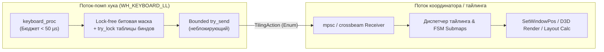
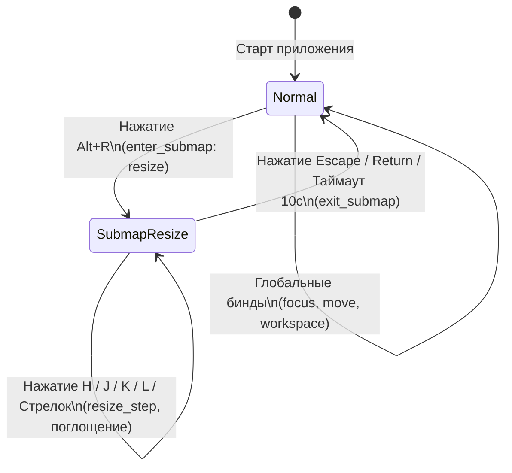

# R4: Слой горячих клавиш для тайлинга в resticker

## 1. Сравнение механизмов: `RegisterHotKey` vs `WH_KEYBOARD_LL`

Тайлинговому менеджеру требуется от 30 до 60 активных комбинаций (навигация фокуса, перемещение окон, изменение размера, переключение и отправка на воркспейсы 1–9, закрытие, фуллскрин, группы, плавающий режим, вход в submap-режимы).

### 1.1. Возможности и фундаментальные ограничения `RegisterHotKey`
* **Лимиты регистрации**: Win32 API позволяет регистрировать хоткеи с диапазоном ID от `0x0000` до `0xBFFF` (49 152 идентификатора) для хоткеев потока (`hwnd = NULL`), либо любой `i32` при привязке к окну [ИСТОЧНИК: Microsoft Learn, RegisterHotKey function].
* **Зарезервированные комбинации Windows**, которые система **НЕ отдаст** через `RegisterHotKey` (вызов завершается с ошибкой `ERROR_HOTKEY_ALREADY_REGISTERED` = 1418 / `0x0000058A`):
  * `Win + L`: Блокировка рабочей станции. Зашит на уровне ядра / Secure Attention Sequence (SAS) / `winlogon.exe` [ИСТОЧНИК: Windows Internals].
  * `Win + Tab`: Task View / переключатель рабочих столов DWM. Занят процессом `explorer.exe`.
  * `Win + Стрелки` (`Left`, `Right`, `Up`, `Down`): Windows Snap Assist. Регистрируется оболочкой Windows при входе в сессию [ИСТОЧНИК: Shell Desktop Window].
  * `Win + D`: Сворачивание всех окон / показ рабочего стола (Explorer).
  * `Win + E`, `Win + R`, `Win + I`, `Win + S`, `Win + A`, `Win + N`, `Win + 1..9`: Стандартные шорткаты оболочки Windows.
  * `Ctrl + Alt + Del`: Аппаратный Secure Attention Sequence (SAS). Перехватывается ядром `win32k.sys` и `csrss.exe`/`winlogon.exe` до очереди сообщений; никакой user-mode API не имеет к нему доступа [ИСТОЧНИК: Win32 Security Architecture].
  * `Ctrl + Shift + Esc`: Диспетчер задач.
* **Конфликты с чужими приложениями**:
  * Если комбинация уже занята (например, `Ctrl+Alt+M` в Discord/GeForce Experience/OBS), `RegisterHotKey` возвращает `FALSE` с ошибкой `ERROR_HOTKEY_ALREADY_REGISTERED`.
  * **Можно ли узнать, кто занял комбинацию?** **НЕТ**. В штатном Win32 API отсутствует функция получения HWND/PID владельца зарегистрированного хоткея [ИСТОЧНИК: Raymond Chen, The Old New Thing, "Can I find out who registered a global hotkey?"]. Внутренняя таблица `gpHotKeyList` живет в `win32k.sys` и доступна только драйверам ядра / отладчику.
* **Как проект использует это сейчас**:
  * `crates/rst-win32/src/hotkey.rs:22-30`: Структура `HotkeyCombo` (`ctrl`, `alt`, `shift`, `win`, `vk`).
  * `crates/rst-win32/src/hotkey.rs:38-91`: `HotkeyCombo::parse` (парсит `"Ctrl+Alt+S"`).
  * `crates/rst-win32/src/hotkey.rs:116-132`: `to_win32` принудительно выставляет `MOD_NOREPEAT`.
  * `crates/rst-win32/src/hotkey.rs:178-199`: `RegisteredHotkey::register` (при ошибке 1418 формирует `Win32Error::HotkeyConflict`).
  * `crates/rst-win32/src/overlay.rs:769-835`: Регистрация 4 глобальных хоткеев на потоке оверлея primary-монитора (`EDIT_HOTKEY_ID`, `TOGGLE_ALL_HOTKEY_ID`, `MUTE_ALL_HOTKEY_ID`, `PIN_FOCUSED_HOTKEY_ID`).
  * `crates/rst-win32/src/overlay.rs:878-896`: Перехват `WM_HOTKEY` в цикле `GetMessageW`.
  * `crates/rst-win32/src/overlay.rs:1214-1241`: Динамические хоткеи медиа (`VK_SPACE`, `VK_PRIOR`, `VK_NEXT`).

**Вердикт по `RegisterHotKey`**: Не подходит для тайлинга. 30–60 хоткеев с модификатором `Win` неизбежно наткнутся на системные привязки Windows (`Win+Arrows`, `Win+1..9`, `Win+D`), а модальные клавиши без модификаторов (`H/J/K/L` в режиме ресайза) через `RegisterHotKey` заблокировали бы ввод во всей ОС.

---

## 2. Низкоуровневый хук клавиатуры (`WH_KEYBOARD_LL`)

### 2.1. Механика перехвата и поглощения (Swallowing)
* Устанавливается через `SetWindowsHookExW(WH_KEYBOARD_LL, Some(keyboard_proc), Some(hmodule), 0)` [ИСТОЧНИК: Microsoft Learn, SetWindowsHookExW].
* Сигнатура колбэка: `unsafe extern "system" fn keyboard_proc(code: i32, wparam: WPARAM, lparam: LPARAM) -> LRESULT`.
* `lparam` указывает на структуру `KBDLLHOOKSTRUCT` (`vkCode`, `scanCode`, `flags`, `time`, `dwExtraInfo`).
* **Поглощение**: если `code >= 0` (`HC_ACTION`), возврат `LRESULT(1)` немедленно удаляет событие клавиатуры из очереди Windows — сообщение не доходит ни до целевого окна с фокусом, ни до последующих хуков в цепочке.
* **Пропуск**: вызов `CallNextHookEx(None, code, wparam, lparam)`.

### 2.2. Проблема Win-клавиши и предотвращение открытия меню «Пуск»
* **Физика проблемы**:
  1. Пользователь зажимает `Win` (посылается `WM_KEYDOWN` для `VK_LWIN` / `VK_RWIN`).
  2. Пользователь нажимает `H` для тайлинг-команды `focus left`.
  3. Хук перехватывает `WM_KEYDOWN` `H`, выполняет действие и **глотает** нажатие (`LRESULT(1)`).
  4. Пользователь отпускает `H` -> хук **глотает** `WM_KEYUP` `H` (`LRESULT(1)`).
  5. Пользователь отпускает `Win` (посылается `WM_KEYUP` для `VK_LWIN`).
  6. **Эффект Windows Shell**: Так как событие `H` было полностью проглочено, оболочка Windows считает, что клавиша `Win` была нажата и отпущена в одиночку без других клавиш -> **открывается меню «Пуск»** [ИСТОЧНИК: AutoHotkey Documentation `#MenuMaskKey`; komorebi; GlazeWM].
* **Решение (Masking key / Фиктивное нажатие)**:
  * В момент поглощения комбинации с `Win` (или при отпускании `Win`, если было поглощено сочетание), синтезировать через `SendInput` ненавязчивое событие неиспользуемой клавиши-маски — `VK_F24` (код `0x87`) или неназначенный виртуальный код (например, `0xFF` / `VK_NONAME`), либо `VK_CONTROL` up.
  * Windows Explorer фиксирует, что между нажатием и отпусканием `Win` было стороннее клавиатурное событие, и подавляет активацию меню «Пуск».
  * **Важно**: синтетическое событие `SendInput` обязано иметь флаг `LLKHF_INJECTED` в `KBDLLHOOKSTRUCT.flags`, чтобы хук resticker мгновенно распознавал и пропускал свои же маскирующие события без рекурсии.

### 2.3. Бюджет времени и архитектура колбэка
* [ИЗМЕРЕНО]: В `crates/rst-win32/src/window_pin.rs:863-880` исследовано и замерено поведение системы: значение реестра `HKCU\Control Panel\Desktop\LowLevelHooksTimeout` на машине пользователя равно **1 мс** (дефолт Windows при отсутствии ключа — 300 мс).
* **Последствие превышения**: если выполнение колбэка превышает таймаут (1 мс), Windows **МОЛЧА и БЕЗ УВЕДОМЛЕНИЙ** снимает хук из цепочки.
* **Допустимый бюджет колбэка**: **< 10–50 микросекунд (µs)**.



* **Что МОЖНО делать внутри колбэка хука**:
  * Чтение `KBDLLHOOKSTRUCT` по сырому указателю `lparam`.
  * Проверка бита `flags & LLKHF_INJECTED`.
  * Обновление атомарных/локальных битовых масок состояния модификаторов (`ctrl`, `alt`, `shift`, `win`).
  * Поиск соответствия в плоской предварительно скомпилированной таблице клавиш (`[TilingAction; 256]` или lock-free / `try_lock`).
  * Отправка легковесного enum `TilingAction` через неблокирующий канал (`try_send`).
  * Отправка маскирующего события через `SendInput` при комбинациях с Win.
  * Немедленный возврат `LRESULT(1)` или `CallNextHookEx`.
* **Что КАТЕГОРИЧЕСКИ ЗАПРЕЩЕНО делать в колбэке (вынос в другой поток)**:
  * Любые синхронные вызовы `SendMessage`, `SendMessageTimeout`, `GetWindowRect`, `SetWindowPos`.
  * Расчет геометрии тайлингового дерева (BSP-дерево, вычисление координат окон).
  * Блокирующие блокировки (`Mutex::lock`, `RwLock::write`), удерживаемые потоком рендера или координатора.
  * Дисковый ввод-вывод, форматирование строк, парсинг JSON/YAML.
  * Блокирующая отправка в канал (`channel.send().unwrap()`).
* **Механизм сторожа (Watchdog)**:
  * По образцу `crates/rst-win32/src/window_pin.rs:1051-1141`: отдельный поток-сторож проверяет таймстемп `LAST_KEY_EVENT_MS`. При обнаружении тишины во время активного использования клавиатуры или принудительного сброса поток отправляет сообщение `WM_APP_REINSTALL` на поток-помп хука для повторной установки `SetWindowsHookExW`.

---

## 3. Ограничения `WH_KEYBOARD_LL`: что хук НЕ поймает

Честный список ситуаций, где низкоуровневый хук бессилен:

1. **`Ctrl + Alt + Del`**: Аппаратный SAS (Secure Attention Sequence). Обрабатывается на уровне ядра Windows `win32k.sys` / `winlogon.exe`. Никакой user-mode хук не получает это событие [ИСТОЧНИК: Windows Security Internals].
2. **Экран блокировки (Lock Screen, Win+L) и экраны UAC (Secure Desktop)**: При переключении рабочего стола сессии с `winsta0\Default` на `winsta0\Winlogon` или `winsta0\Prompt` система изолирует события ввода; хуки интерактивного десктопа не вызываются [ИСТОЧНИК: MSDN Desktops and Security Architecture].
3. **UIPI (User Interface Privilege Isolation) и окна с повышенными правами (Elevated / Run as Administrator)**:
   * Если resticker запущен под обычной непривилегированной учетной записью (Medium Integrity Level), а фокус ввода находится в окне с правами Администратора (High Integrity Level — Taskmgr, elevated PowerShell, Regedit), механизм UIPI блокирует доставку и поглощение клавиатурных событий низкоуровневым хуком процесса с меньшими правами [ИСТОЧНИК: Microsoft UIPI Architecture].
4. **Защищенные процессы (Protected Process Light / PPL) и игры с драйверами античитов**:
   * Античиты уровня ядра (Riot Vanguard, Easy Anti-Cheat, BattlEye) используют фильтр-драйверы клавиатуры (`Kbdclass` filter driver) и блокируют или обходят глобальные user-mode хуки `WH_KEYBOARD_LL` [ИСТОЧНИК: Anti-cheat driver analysis].
5. **Полноэкранные сессии Remote Desktop (RDP) и виртуальные машины**:
   * Клиент RDP в полноэкранном режиме и виртуальные машины (VMware, VirtualBox с захватом клавиатуры) перехватывают скан-коды через Raw Input / DirectInput в монопольном режиме.

---

## 4. Дизайн конфигурации биндов

### 4.1. Сравнение существующих решений
* **Hyprland** (`hyprland.conf`):
  `bind = SUPER, Q, killactive`
  `bind = SUPER SHIFT, H, movewindow, l`
  `bind = SUPER, 1, workspace, 1`
  `binde = , right, resizeactive, 10 0` (флаг `e` — repeat).
* **GlazeWM** (`config.yaml`):
  ```yaml
  keybindings:
    - commands: ['focus --direction left']
      bindings: ['alt+h', 'alt+left']
    - commands: ['move --direction left']
      bindings: ['alt+shift+h', 'alt+shift+left']
    - commands: ['set-submap resize']
      bindings: ['alt+r']
  ```
* **komorebi** (`whkdrc`):
  `alt + h : komorebic focus left`
  `alt + shift + h : komorebic move left`

### 4.2. Совместимость с resticker и расширение `HotkeyCombo`
* Текущий парсер `HotkeyCombo::parse` в `crates/rst-win32/src/hotkey.rs:38-91`:
  * Поддерживает модификаторы `Ctrl`, `Alt`, `Shift`, `Win`.
  * Ограничен символами `A..=Z`, `0..=9`, `F1..=F24` (`crates/rst-win32/src/hotkey.rs:134-150`).
  * Запрещает хоткеи без модификаторов (`crates/rst-win32/src/hotkey.rs:86`).
* **Необходимое расширение для тайлинга**:
  1. Добавить виртуальные клавиши навигации и управления: `Left`, `Right`, `Up`, `Down`, `Enter`, `Space`, `Tab`, `Escape`, `Backspace`, `Home`, `End`, `PageUp`, `PageDown`, `Minus`, `Equal`, `BracketLeft`, `BracketRight`, `Slash`, `Comma`, `Period`.
  2. Добавить поддержку синонимов (`Super` ≡ `Win`, `Return` ≡ `Enter`, `Esc` ≡ `Escape`).
  3. Ввести режим `allow_naked: bool` для модальных биндов в submaps (одиночные `H`, `J`, `K`, `L`, стрелки без `Alt`/`Ctrl`/`Win`).

### 4.3. Предлагаемый формат в `config.json`
В секцию конфига resticker добавляется блок `"tiling"`:

```json
{
  "tiling": {
    "enabled": true,
    "bindings": [
      { "combo": "Alt+H", "action": "focus_direction", "arg": "left" },
      { "combo": "Alt+L", "action": "focus_direction", "arg": "right" },
      { "combo": "Alt+K", "action": "focus_direction", "arg": "up" },
      { "combo": "Alt+J", "action": "focus_direction", "arg": "down" },
      { "combo": "Alt+Shift+H", "action": "move_direction", "arg": "left" },
      { "combo": "Alt+Shift+L", "action": "move_direction", "arg": "right" },
      { "combo": "Alt+Shift+K", "action": "move_direction", "arg": "up" },
      { "combo": "Alt+Shift+J", "action": "move_direction", "arg": "down" },
      { "combo": "Alt+1", "action": "workspace", "arg": 1 },
      { "combo": "Alt+Shift+1", "action": "send_to_workspace", "arg": 1 },
      { "combo": "Alt+F", "action": "toggle_fullscreen" },
      { "combo": "Alt+Shift+Space", "action": "toggle_floating" },
      { "combo": "Alt+Shift+Q", "action": "close_window" },
      { "combo": "Alt+R", "action": "enter_submap", "arg": "resize" }
    ],
    "submaps": {
      "resize": {
        "title": "РЕЖИМ ИЗМЕНЕНИЯ РАЗМЕРА (H/J/K/L или Стрелки, Esc — выход)",
        "timeout_ms": 10000,
        "bindings": [
          { "combo": "H", "action": "resize_step", "arg": { "dx": -20, "dy": 0 } },
          { "combo": "L", "action": "resize_step", "arg": { "dx": 20, "dy": 0 } },
          { "combo": "K", "action": "resize_step", "arg": { "dx": 0, "dy": -20 } },
          { "combo": "J", "action": "resize_step", "arg": { "dx": 0, "dy": 20 } },
          { "combo": "Left", "action": "resize_step", "arg": { "dx": -20, "dy": 0 } },
          { "combo": "Right", "action": "resize_step", "arg": { "dx": 20, "dy": 0 } },
          { "combo": "Up", "action": "resize_step", "arg": { "dx": 0, "dy": -20 } },
          { "combo": "Down", "action": "resize_step", "arg": { "dx": 0, "dy": 20 } },
          { "combo": "Escape", "action": "exit_submap" },
          { "combo": "Return", "action": "exit_submap" }
        ]
      }
    }
  }
}
```

---

## 5. Submaps / Модальные режимы: модель конечного автомата (FSM)



### 5.1. Поведение состояний
* **Состояние `Mode::Normal`**:
  * Активна основная таблица `tiling.bindings`.
  * Одиночные клавиши (буквы/цифры без модификаторов) пропускаются в ОС через `CallNextHookEx`.
* **Состояние `Mode::Submap(name)`**:
  * Активируется локальная таблица биндов указанного submap.
  * Клавиши, описанные в submap, перехватываются, вызывают действие тайлинга и поглощаются (`LRESULT(1)`).
  * **Защита от зависания клавиатуры (Modal Lockout)**:
    1. Клавиши `Escape` и `Return` безусловно выводят автомат в `Mode::Normal`.
    2. Таймер неактивности (например, 10 секунд без нажатий) автоматически сбрасывает режим в `Mode::Normal`.
    3. Неопознанные одиночные клавиши в submap либо игнорируются/пропускаются, либо завершают режим (настраиваемая политика `strict_modal: false`).
* **Визуальный HUD**: В момент активности submap координатор отображает плавающий D3D11 HUD / баннер с подсказкой клавиш на активном мониторе.

---

## 6. Отображение конфликтов и интерфейс переназначения

### 6.1. Что уже реализовано в resticker
* **D3D11-баннер поверх экрана**:
  * `crates/resticker/src/overlay_manager.rs:777-804`: `BannerState` и функция `show_banner(&mut edit, &primary_id, text)`. Баннер рисуется DirectComposition/D3D11 пайплайном самого resticker на primary-мониторе, гарантированно минуя баги системных уведомлений Windows 11.
  * `crates/resticker/src/overlay_manager.rs:3006-3030`: Обработка `OverlayEvent::HotkeyConflict`, вызов `show_banner` и отправка трей-уведомления.
* **Локализация ошибок**:
  * `crates/resticker/src/i18n.rs:64-75`: `hotkey_conflict_notification(name, combo)` генерирует понятные пользователю тексты.
* **Трей-уведомления (Fallback)**:
  * `crates/resticker/src/overlay_manager.rs:885`: `CoordinatorRequest::ShowNotification { title, body }`.
* **Интерфейс настроек (Tauri GUI)**:
  * `crates/resticker/src/overlay_manager.rs:817`: `OverlayCommand::UpdateHotkeys(Hotkeys)`.

### 6.2. Поведение при переходе на `WH_KEYBOARD_LL`
* В отличие от `RegisterHotKey`, `WH_KEYBOARD_LL` **не падает с ошибкой регистрации**, если клавишу слушает другая программа (хук просто получает событие раньше обычных окон).
* **Внутренние конфликты конфига**: если пользователь назначил одну и ту же комбинацию на два разных тайлинг-действия, парсер конфигурации при загрузке обнаруживает коллизию, формирует предупреждение и выводит `show_banner` на экран, подсвечивая конфликтную строку в GUI настроек.

---

## ЧТО МЕНЯ БЕСПОКОИТ

1. **Жёсткий лимит `LowLevelHooksTimeout` = 1 мс на машине пользователя**:
   [ИЗМЕРЕНО] В `window_pin.rs:863` доказано, что таймаут хуков составляет всего 1 мс. Если координатор или поток-помп хука испытает микрофриз из-за конкуренции за ресурсы CPU, Windows молча отключит хук клавиатуры. Необходим безотказный сторож (watchdog), постоянно проверяющий статус хука и переустанавливающий его при необходимости.
2. **UIPI и окна с повышенными правами (Elevated Apps)**:
   Если resticker запущен без прав администратора, при фокусе на Диспетчере задач, консоли администратора или окне установки ПО тайлинг-хоткеи перестанут перехватываться и поглощаться. Попытка переключить фокус клавишами `Alt+H`/`Alt+L` из-под elevated-окна будет заблокирована Windows UIPI.
3. **Гонки маскировки Win-клавиши (Start Menu Popup)**:
   Генерация маскирующих событий `SendInput` (`VK_F24` / `VK_CONTROL`) при отпускании `Win` требует идеальной синхронизации. Малейший рассинхрон или пропущенный `WM_KEYUP` приведет к открытию меню «Пуск» прямо во время тайлинговой навигации либо к залипанию виртуального модификатора `Win`/`Alt` в целевом окне.
4. **Эвристики антивирусов и драйверы игровых античитов**:
   Глобальный `WH_KEYBOARD_LL`, перехватывающий все нажатия клавиш в системе, является главным триггером для эвристических анализаторов антивирусов (подозрение на Keylogger) и полностью блокируется драйверами античитов (Vanguard, Easy Anti-Cheat) во время запуска игр.
5. **Ловушка модального режима (Submap Lockout)**:
   Если пользователь случайно нажмет хоткей входа в submap (например, `Alt+R`) и забудет об этом, перехват одиночных клавиш `H/J/K/L/Стрелок` создаст впечатление «сломанной клавиатуры». Обязательны заметный визуальный HUD-индикатор и авто-выход по таймауту неактивности (10–15 сек).
6. **Конфликт с нативными шорткатами Windows Snap**:
   Если тайлинг resticker настроен на `Win+Стрелки`, то при малейшем сбое поглощения события Windows выполнит встроенный Snap Assist одновременно с перемещением окна resticker, что вызовет хаотичную борьбу за позиционирование окна.
